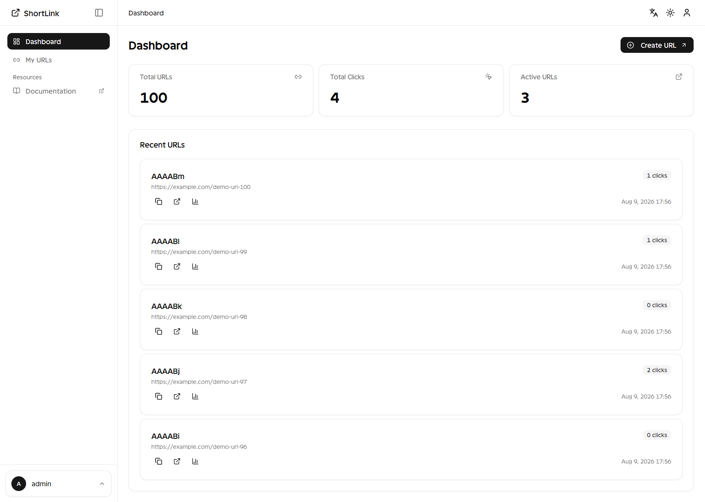
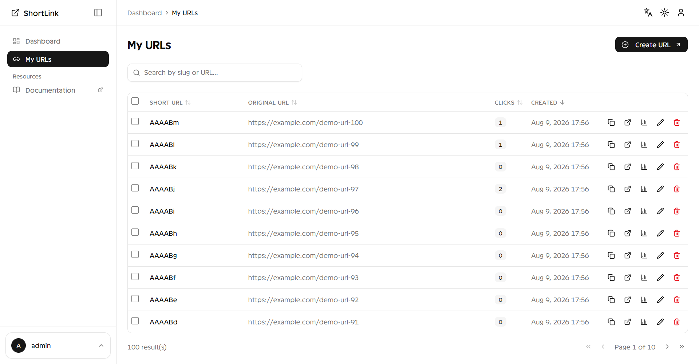
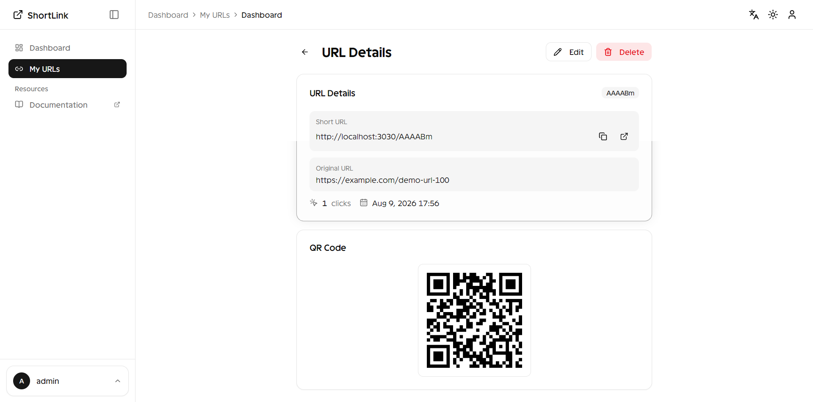

<div align="center">

# 🔗 URL Shortener

A production-ready URL shortener with a **.NET 10** backend API and a **Next.js 16** frontend, backed by **PostgreSQL**.

[](https://dotnet.microsoft.com/)
[](https://nextjs.org/)
[](https://react.dev/)
[](https://www.typescriptlang.org/)
[](https://www.postgresql.org/)
[](https://www.docker.com/)
[](https://tailwindcss.com/)
[](LICENSE)

<br/>



</div>

---

## ✨ Features

- **Short URL creation** — v1 (random base62) & v2 (counter-based base62 with XOR obfuscation)
- **Smart redirect** — 301/302 redirect with click tracking
- **Dashboard** — List, search, sort & filter URLs with pagination
- **Per-URL stats** — Click count, created/expiry dates
- **QR code generation** — Built-in QR codes for every short URL
- **Edit & delete** — Full CRUD from the UI
- **Health checks** — `/health` endpoint for monitoring
- **API docs** — Swagger/Scalar at `/doc`
- **Basic authentication** — Secured API endpoints
- **Multi-language (i18n)** — Language toggle support
- **Seed data** — Pre-loaded with famous brand URLs (Google, YouTube, Apple, etc.)

---

## 🏗️ Tech Stack

| Layer | Tech |
|-------|------|
| **Backend** | ASP.NET Core 10 (Minimal API), EF Core 10, FluentValidation, Asp.Versioning, Scalar |
| **Database** | PostgreSQL 15 |
| **Frontend** | Next.js 16 (App Router), React 19, TypeScript 5, Tailwind CSS v4, TanStack Query, shadcn/ui, Recharts |
| **Infra** | Docker / Docker Compose |

---

## 📸 Screenshots

<table>
  <tr>
    <td align="center"><strong>Dashboard</strong></td>
    <td align="center"><strong>URL List</strong></td>
    <td align="center"><strong>URL Details</strong></td>
  </tr>
  <tr>
    <td></td>
    <td></td>
    <td></td>
  </tr>
</table>

---

## 🚀 Quick Start

### Docker (recommended)

```bash
cp .env.example .env   # edit values if needed
docker compose up --build
```

| Service | URL |
|---------|-----|
| Frontend | http://localhost:3030 |
| Backend API | http://localhost:5030 |
| API Docs (Scalar) | http://localhost:5030/doc |
| Health Check | http://localhost:5030/health |
| pgAdmin | http://localhost:5050 |
| PostgreSQL | localhost:5432 |

> Demo login (frontend): `admin` / `admin`

### Local Development

**Backend (.NET 10)**

```bash
dotnet run --project backend/src/UrlShortener.WebApi
```

**Frontend (Next.js 16)**

```bash
cd frontend
npm install
NEXT_PUBLIC_API_URL=http://localhost:5030 npm run dev
```

---

## ⚙️ Configuration

All values live in `.env` and are consumed by Docker Compose.

| Variable | Purpose |
|----------|---------|
| `DB_NAME` | PostgreSQL database name |
| `DB_USER` | PostgreSQL user |
| `DB_PASSWORD` | PostgreSQL password |
| `DB_PORT` | PostgreSQL container port (default: `5432`) |
| `API_PORT` | Backend API port (default: `5030`) |
| `UI_PORT` | Frontend port (default: `3030`) |
| `BACKEND_URL` | URL the browser uses to reach the API |
| `CORS_ORIGINS` | Comma-separated allowed browser origins |
| `ASPNETCORE_ENVIRONMENT` | `Development` or `Production` |

---

## 📁 Project Structure

```
├── .env
├── docker-compose.yml
├── backend/
│   ├── UrlShortener.slnx
│   ├── Dockerfile
│   └── src/
│       ├── UrlShortener.Domain/           # Entities, value objects
│       ├── UrlShortener.Application/      # Services (v1/v2), DTOs, validators
│       ├── UrlShortener.Infrastructure/   # EF Core, repositories, migrations
│       └── UrlShortener.WebApi/           # Minimal API endpoints
│           ├── Endpoints/
│           ├── Handlers/
│           ├── Filters/
│           ├── HealthChecks/
│           └── Init/                      # DatabaseInitializer (seed data)
├── frontend/
│   └── src/
│       ├── app/                           # App Router routes
│       ├── components/                    # UI components (shadcn/ui)
│       ├── lib/                           # API client, services, hooks
│       └── contexts/                      # Auth, Language contexts
└── doc/img/                               # Screenshots
```

---

## 🔌 API Endpoints

Base: `/api/v1` and `/api/v2`

| Method | Route | Description |
|--------|-------|-------------|
| `POST` | `/urls` | Create a short URL |
| `GET` | `/urls` | List with pagination + search/filter |
| `GET` | `/urls/{slug}` | URL statistics |
| `GET` | `/{slug}` | Redirect to original URL |
| `GET` | `/` | Redirect to `/doc` |
| `GET` | `/health` | Health check |

### Versioning

- **v1** — Random base62 slug generation
- **v2** — Counter-based base62 with XOR obfuscation for non-sequential appearance

### Authentication

Basic Auth: `Authorization: Basic <base64(user:pass)>`. Credentials configured in `BasicAuthenticationHandler`.

---

## 🗄️ Database

EF Core migrations apply automatically on startup when `CONNECTION_STRING` is set.

```bash
# Generate new migration
dotnet ef migrations add <Name> \
  --project backend/src/UrlShortener.Infrastructure \
  --startup-project backend/src/UrlShortener.WebApi \
  --output-dir Migrations
```

---

## 🐳 Docker Commands

```bash
# View logs
docker compose logs -f api
docker compose logs -f ui

# Rebuild single service
docker compose build api && docker compose up -d api

# Stop and remove volumes (data loss!)
docker compose down -v

# Run with specific version tag
VERSION=v2 docker compose up --build
```

---

## 🧪 Frontend Routes

| Route | Description |
|-------|-------------|
| `/` | Dashboard redirect |
| `/login` | Login page |
| `/urls` | URL list with pagination, search, filters |
| `/urls/[id]` | URL detail / stats |
| `/urls/[id]/edit` | Edit URL |
| `/[shortCode]` | Redirect to original URL |

---

<div align="center">

**Built with ❤️ using .NET 10 + Next.js 16 + PostgreSQL**

</div>
